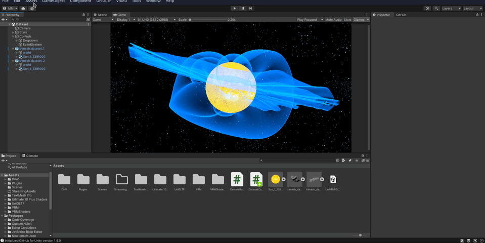

# Creating contour visualisations in Unity

This section explaines the process of creating a 3D model of a contour from a triangular mesh.

## Python
To be able to use the triangular mesh generated in python in Unity, you need to export the mesh in a suitable file format. There are many formats supported by Unity. I have found that using the `trimesh` Python module to export the mesh in `.glb` format works quite well.

However, when exporting any mesh, I recommend swapping the axes order to match Unity, i.e. using Y axis as the 'up' axis. In my case, this helped to remove problems with incorrect orientation and inverted normal vectors when importing the mesh into Unity.

An example of how a triangular mesh might be created and imported in Python using the `trimesh` module:
``` python
vertices, faces, normals, _ = skimage.measure.marching_cubes(data)
mesh = trimesh.Trimesh(
    vertices=vertices[:, (0, 2, 1)],
    faces=faces,
    vertex_normals=normals[:, (0, 2, 1)],
)
mesh.export("mesh.glb")

```

## Unity
The Unity project already has the camera, background and control elements configured. To add new triangular meshes into the project, you'll need to follow these instructions:

1. Import the triangular mesh by going to **Assets > Import New Asset...**.
2. Drag the newly imported asset from the **Assets** pane into the root of the scene in the **Hierarchy** pane. Rename the game object to `trimesh_dataset_#`, replacing `#` with the number you wish to assign to the dataset.
3. Change the asset's root game object tag from **Untagged** to **Dataset** in the **Inspector** pane.
4. Change the asset's scale in the **Inspector** pane so that it fits neatly into the camera view.
5. Copy the **Sun** game object from any other dataset in the project and set it's parent to be the root of the newly imported asset. Setting the parent can be done by dragging one object onto the other in the **Hierarchy** pane.
6. Find the triangular mesh object of the imported asset and in the **Inspector** pane, set it's material to **Force Field**. Depending on the format of the imported asset, the mesh object might be a child of several other objects within the imported asset's tree.
7. In the **Hierarchy** pane, select **Controls/Dropdown**. In the **Inspector** pane of the Dropdown object, scroll down to the options list and add an entry by clicking on the plus sign. The text of the entry should read `Dataset #`, where `#` is the same number as in step *2.*

Following these steps will make sure that the dropdown menu in the bottom left corner properly shows and hides requested datasets and set's all visual properties to match all other meshes' look.

Alternatively, you might follow the instructions in this GIF:


